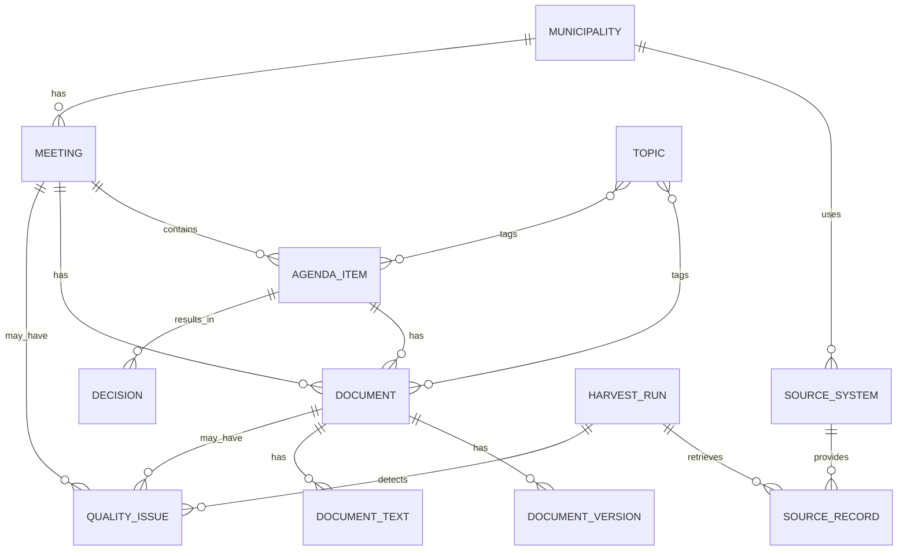

# Canoniek datamodel

## Doel

Het canonieke datamodel zorgt ervoor dat data uit verschillende RIS-bronnen op dezelfde manier kan worden verwerkt, gepubliceerd en getoond. De brondata mag per leverancier verschillen. Vanaf de normalisatielaag werkt het project met dezelfde entiteiten, velden en relaties.

De huidige MVP implementeert vooral het documentdeel van dit model. Dat is bewust: documenten zijn het eerste bewezen endpoint in de Huizen-implementatie. Het bredere model blijft richtinggevend voor de volgende fases.

## Status van het model

| Entiteit | Status | Toelichting |
|---|---|---|
| Municipality | conceptueel aanwezig | via gemeenteconfiguratie |
| SourceSystem | conceptueel aanwezig | via gemeenteconfiguratie |
| Document | geimplementeerd | eerste canonieke model |
| HarvestRun | geimplementeerd | vastlegging van harvest-resultaten |
| Meeting | gepland | afhankelijk van endpointonderzoek |
| AgendaItem | gepland | afhankelijk van endpointonderzoek |
| DocumentVersion | gepland | nodig voor checksums en wijzigingen |
| QualityIssue | gepland | nodig voor datakwaliteitsrapportage |
| Relation | gepland | nodig voor koppelingen tussen entiteiten |
| Person, Organization, Topic, Decision | later | buiten MVP-scope |

## Kernentiteiten

Voor de MVP en directe vervolgstappen zijn dit de kernentiteiten:

```text
Municipality
SourceSystem
Document
HarvestRun
DocumentVersion
QualityIssue
Meeting
AgendaItem
Relation
```

Latere uitbreidingen:

```text
Person
Organization
Decision
Topic
DocumentText
```

## Relatiemodel



## Identifierbeleid

Gebruik stabiele eigen identifiers. Vertrouw niet uitsluitend op bron-ID's.

Voorgesteld patroon:

```text
{municipality_slug}-{resource_type}-{source_id}
```

Voorbeelden:

```text
huizen-document-25892
huizen-meeting-2026-05-21-raad
huizen-agendaitem-abc123
```

Bron-ID's blijven altijd bewaard in:

```text
source_id
```

Als een bron meerdere relevante IDs heeft, bewaren we die expliciet, bijvoorbeeld:

```text
source_object_id
```

## Municipality

Gemeentegegevens komen primair uit configuratie.

```json
{
  "id": "gm0406",
  "slug": "huizen",
  "name": "Huizen",
  "country": "NL",
  "official_identifier": "gm0406",
  "website_url": "https://www.huizen.nl",
  "ris_url": "https://ris.gemeenteraadhuizen.nl",
  "timezone": "Europe/Amsterdam"
}
```

## SourceSystem

Het bronsysteem komt primair uit configuratie.

```json
{
  "id": "huizen-gemeenteoplossingen",
  "municipality_id": "gm0406",
  "vendor": "GemeenteOplossingen",
  "base_url": "https://ris.gemeenteraadhuizen.nl/api/v2/",
  "api_version": "v2",
  "connector": "gemeenteoplossingen",
  "active": true
}
```

## Document

Status: geimplementeerd voor de document-first MVP.

Doel: een leveranciersneutrale representatie van een RIS-document.

```json
{
  "id": "huizen-document-25892",
  "source_id": "25892",
  "source_object_id": "43243",
  "municipality_id": "gm0406",
  "municipality_slug": "huizen",
  "source_system_id": "huizen-gemeenteoplossingen",
  "title": "Verzoek commissiebehandeling de heer Heutink Mededeling over Evaluatie Ellertsveld",
  "description": "Verzoek commissiebehandeling de heer Heutink Mededeling over Evaluatie Ellertsveld",
  "document_type": "Overig",
  "filename": "Verzoek commissiebehandeling de heer Heutink Mededeling over Evaluatie Ellertsveld.pdf",
  "mime_type": "application/pdf",
  "file_size_bytes": 62118,
  "publication_datetime": "2026-05-19T00:00:00+02:00",
  "publication_timezone": "Europe/Berlin",
  "source_url": "https://ris.gemeenteraadhuizen.nl/api/v2/documents/25892/download",
  "download_url": "https://ris.gemeenteraadhuizen.nl/api/v2/documents/25892/download",
  "is_confidential": false,
  "is_tabsign_document": false,
  "raw": {}
}
```

### Mapping GemeenteOplossingen naar Document

| Bronveld | Canoniek veld | Opmerking |
|---|---|---|
| `id` | `source_id` | bron-ID document |
| `objectId` | `source_object_id` | aanvullende bron-ID |
| `description` | `title`, `description` | voorlopig als titel gebruikt |
| `documentTypeLabel` | `document_type` | bronlabel documentsoort |
| `fileName` | `filename` | originele bestandsnaam |
| `fileSize` | `file_size_bytes` | bestandsgrootte volgens API |
| `publicationDate.date` | `publication_datetime` | bronpublicatiedatum |
| `publicationDate.timezone` | `publication_timezone` | timezone uit bron |
| `confidential` | `is_confidential` | bronwaarde omgezet naar boolean |
| `isTabsignDocument` | `is_tabsign_document` | bronwaarde omgezet naar boolean |

## HarvestRun

Status: geimplementeerd.

Doel: vastleggen wat een harvest-run heeft gedaan en hoeveel records zijn verwerkt.

```json
{
  "id": "harvest-huizen-20260527T204635Z",
  "municipality_id": "gm0406",
  "source_system_id": "huizen-gemeenteoplossingen",
  "started_at": "2026-05-27T20:46:35Z",
  "finished_at": "2026-05-27T20:46:37Z",
  "status": "success",
  "meetings_seen": 0,
  "agenda_items_seen": 0,
  "documents_seen": 25,
  "documents_committed": 0,
  "documents_downloaded_temporarily": 0,
  "quality_issues_detected": 0
}
```

## DocumentVersion

Status: gepland voor issue #12.

Doel: documentwijzigingen detecteerbaar maken zonder PDF's structureel in Git op te slaan.

```json
{
  "id": "huizen-document-25892-version-2026-05-27",
  "document_id": "huizen-document-25892",
  "retrieved_at": "2026-05-27T03:00:00+02:00",
  "sha256": "...",
  "file_size_bytes": 62118,
  "content_changed": false,
  "metadata_changed": true,
  "previous_version_id": null
}
```

## QualityIssue

Status: gepland voor issue #13.

Doel: datakwaliteit zichtbaar maken.

```json
{
  "id": "quality-2026-05-27-001",
  "resource_type": "document",
  "resource_id": "huizen-document-25892",
  "severity": "warning",
  "issue_type": "generic_filename",
  "message": "Document heeft een generieke of weinig informatieve bestandsnaam.",
  "detected_at": "2026-05-27T03:00:00+02:00"
}
```

## Meeting

Status: gepland voor issue #14.

```json
{
  "id": "huizen-meeting-2026-05-21-raad",
  "source_id": "12345",
  "municipality_id": "gm0406",
  "source_system_id": "huizen-gemeenteoplossingen",
  "title": "Raadsvergadering",
  "body_type": "raad",
  "status": "gepland",
  "start_datetime": "2026-05-21T20:00:00+02:00",
  "end_datetime": null,
  "location": "Raadzaal gemeentehuis Huizen",
  "web_url": "https://ris.gemeenteraadhuizen.nl/..."
}
```

## AgendaItem

Status: gepland voor issue #14.

```json
{
  "id": "huizen-agendaitem-abc123",
  "source_id": "67890",
  "meeting_id": "huizen-meeting-2026-05-21-raad",
  "municipality_id": "gm0406",
  "number": "7",
  "title": "Vaststellen bestemmingsplan",
  "description": null,
  "position": 7,
  "status": "behandeld",
  "web_url": "https://ris.gemeenteraadhuizen.nl/..."
}
```

## Relation

Status: gepland.

Doel: relaties expliciet vastleggen, zeker wanneer het bronsysteem relaties niet direct of niet uniform levert.

```json
{
  "id": "relation-huizen-document-25892-agendaitem-abc123",
  "source_resource_type": "document",
  "source_resource_id": "huizen-document-25892",
  "target_resource_type": "agenda_item",
  "target_resource_id": "huizen-agendaitem-abc123",
  "relation_type": "belongs_to",
  "confidence": 1.0,
  "derived": false
}
```

## Public export contract

De public exports vormen het contract voor viewers en hergebruikers.

Huidig:

```text
data/public/documents.jsonl
data/public/harvest_runs.jsonl
data/public/latest.json
```

Toekomstig:

```text
data/public/meetings.jsonl
data/public/agenda_items.jsonl
data/public/document_versions.jsonl
data/public/quality_issues.jsonl
data/public/relations.jsonl
```

Breaking changes in deze bestanden moeten bewust worden gedaan en in de roadmap worden benoemd.
