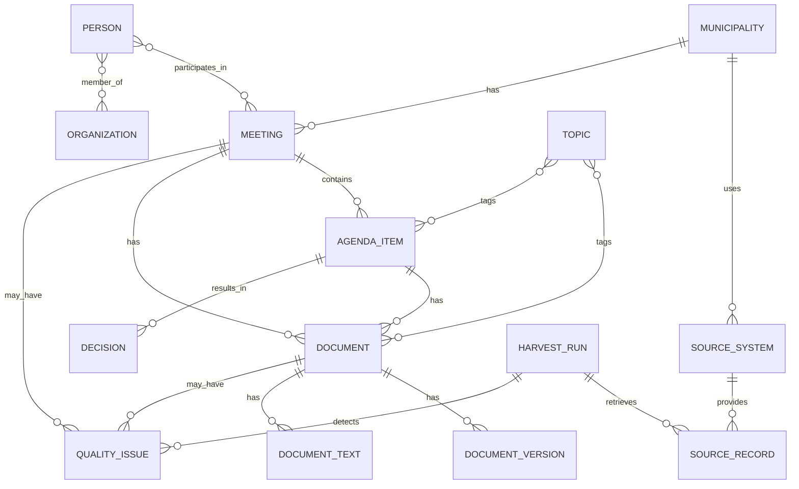

# Canoniek datamodel

## Doel

Het canonieke datamodel zorgt ervoor dat data uit verschillende RIS-bronnen op dezelfde manier kan worden verwerkt, gepubliceerd en getoond.

De brondata mag per leverancier verschillen. Vanaf de normalisatielaag werkt het project met dezelfde entiteiten en relaties.

## Kernentiteiten

Voor de MVP zijn dit de kernentiteiten:

- Municipality
- SourceSystem
- Meeting
- AgendaItem
- Document
- DocumentVersion
- HarvestRun
- QualityIssue

Later uitbreidbaar met:

- Person
- Organization
- Decision
- Topic
- Relation

## Relatiemodel



## Identifierbeleid

Gebruik stabiele eigen identifiers. Vertrouw niet uitsluitend op bron-ID's.

Voorgesteld patroon:

```text
{municipality_slug}-{resource_type}-{stable_hash}
```

Voorbeeld:

```text
huizen-document-def456
huizen-meeting-2026-05-21-raad
```

Bron-ID's blijven wel bewaard in `source_id`.

## Municipality

```json
{
  "id": "gm0406",
  "slug": "huizen",
  "name": "Huizen",
  "country": "NL",
  "official_identifier": "gm0406",
  "website_url": "https://www.huizen.nl",
  "ris_url": "https://ris.gemeenteraadhuizen.nl",
  "timezone": "Europe/Amsterdam"
}
```

## SourceSystem

```json
{
  "id": "huizen-gemeenteoplossingen",
  "municipality_id": "gm0406",
  "vendor": "GemeenteOplossingen",
  "base_url": "https://ris.gemeenteraadhuizen.nl/api/v2/",
  "api_version": "v2",
  "connector": "gemeenteoplossingen",
  "active": true
}
```

## Meeting

```json
{
  "id": "huizen-meeting-2026-05-21-raad",
  "source_id": "12345",
  "municipality_id": "gm0406",
  "source_system_id": "huizen-gemeenteoplossingen",
  "title": "Raadsvergadering",
  "body_type": "raad",
  "status": "gepland",
  "start_datetime": "2026-05-21T20:00:00+02:00",
  "end_datetime": null,
  "location": "Raadzaal gemeentehuis Huizen",
  "web_url": "https://ris.gemeenteraadhuizen.nl/...",
  "retrieved_at": "2026-05-27T03:00:00+02:00"
}
```

## AgendaItem

```json
{
  "id": "huizen-agendaitem-abc123",
  "source_id": "67890",
  "meeting_id": "huizen-meeting-2026-05-21-raad",
  "municipality_id": "gm0406",
  "number": "7",
  "title": "Vaststellen bestemmingsplan",
  "description": null,
  "position": 7,
  "status": "behandeld",
  "web_url": "https://ris.gemeenteraadhuizen.nl/...",
  "retrieved_at": "2026-05-27T03:00:00+02:00"
}
```

## Document

```json
{
  "id": "huizen-document-def456",
  "source_id": "98765",
  "municipality_id": "gm0406",
  "source_system_id": "huizen-gemeenteoplossingen",
  "meeting_id": "huizen-meeting-2026-05-21-raad",
  "agenda_item_id": "huizen-agendaitem-abc123",
  "title": "Raadsvoorstel bestemmingsplan",
  "document_type": "raadsvoorstel",
  "filename": "raadsvoorstel.pdf",
  "mime_type": "application/pdf",
  "source_url": "https://ris.gemeenteraadhuizen.nl/...",
  "download_url": "https://ris.gemeenteraadhuizen.nl/...",
  "date_published": "2026-05-14",
  "date_meeting": "2026-05-21",
  "language": "nl",
  "sha256": null,
  "file_size_bytes": null,
  "text_status": "not_processed",
  "retrieved_at": "2026-05-27T03:00:00+02:00"
}
```

## DocumentVersion

```json
{
  "id": "huizen-document-def456-version-2026-05-27",
  "document_id": "huizen-document-def456",
  "retrieved_at": "2026-05-27T03:00:00+02:00",
  "sha256": "...",
  "file_size_bytes": 1234567,
  "content_changed": false,
  "metadata_changed": true,
  "previous_version_id": "huizen-document-def456-version-2026-05-26"
}
```

## HarvestRun

```json
{
  "id": "harvest-2026-05-27",
  "municipality_id": "gm0406",
  "source_system_id": "huizen-gemeenteoplossingen",
  "started_at": "2026-05-27T03:00:00+02:00",
  "finished_at": "2026-05-27T03:07:12+02:00",
  "status": "success",
  "meetings_seen": 25,
  "agenda_items_seen": 180,
  "documents_seen": 640,
  "documents_downloaded_temporarily": 80,
  "documents_committed": 0,
  "quality_issues_detected": 14
}
```

## QualityIssue

```json
{
  "id": "quality-2026-05-27-001",
  "resource_type": "document",
  "resource_id": "huizen-document-def456",
  "severity": "warning",
  "issue_type": "generic_filename",
  "message": "Document heeft generieke bestandsnaam: besluit.pdf",
  "detected_at": "2026-05-27T03:00:00+02:00"
}
```
