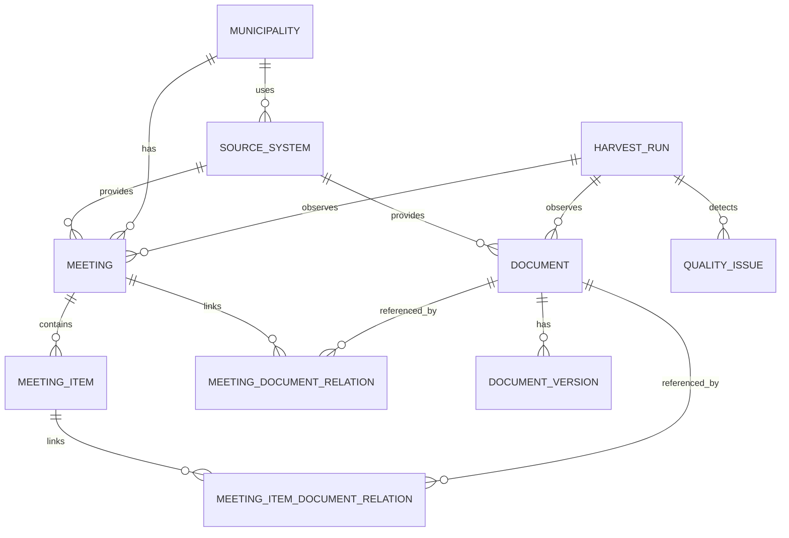

# Canoniek datamodel

## Doel

Het canonieke datamodel zorgt ervoor dat data uit verschillende RIS-bronnen op dezelfde manier kan worden verwerkt, gepubliceerd en getoond. De brondata mag per leverancier verschillen. Vanaf de normalisatielaag werkt het project met dezelfde entiteiten, velden en relaties.

De MVP is begonnen als document-first implementatie. De huidige lijn voegt daar vergaderingen, agendapunten, documentrelaties, kwaliteits-signalen en documenttype-normalisatie aan toe.

## Status van het model

| Entiteit | Status | Toelichting |
|---|---|---|
| Municipality | conceptueel aanwezig | via gemeenteconfiguratie |
| SourceSystem | conceptueel aanwezig | via gemeenteconfiguratie |
| Document | geimplementeerd | eerste canonieke model, inclusief documenttype-velden |
| DocumentVersion | geimplementeerd | checksums en documentobservaties |
| HarvestRun | geimplementeerd | vastlegging van harvest-resultaten |
| Meeting | geimplementeerd voor GemeenteOplossingen | via `/meetingsessions` en `/meetings/{id}` |
| MeetingItem | geimplementeerd voor GemeenteOplossingen | functioneel het agendapunt |
| MeetingDocumentRelation | geimplementeerd | koppeling tussen vergadering en document |
| MeetingItemDocumentRelation | geimplementeerd | koppeling tussen agendapunt en document |
| QualityIssue | gepland | nodig voor datakwaliteitsrapportage |

## Kernentiteiten

Voor de huidige MVP en directe vervolgstappen zijn dit de kernentiteiten:

```text
Municipality
SourceSystem
Document
DocumentVersion
HarvestRun
Meeting
MeetingItem
MeetingDocumentRelation
MeetingItemDocumentRelation
QualityIssue
```

Latere uitbreidingen:

```text
Person
Organization
Decision
Topic
DocumentText
```

## Relatiemodel



## Identifierbeleid

Gebruik stabiele eigen identifiers. Vertrouw niet uitsluitend op bron-ID's.

Voorgesteld patroon:

```text
{municipality_slug}-{resource_type}-{source_id}
```

Voorbeelden:

```text
huizen-document-25892
huizen-meeting-19
huizen-meeting-item-142
```

Relatie-ID's combineren de betrokken bron-ID's:

```text
huizen-meeting-19-document-3127
huizen-meeting-item-142-document-158
```

Bron-ID's blijven altijd bewaard in:

```text
source_id
```

Als een bron meerdere relevante IDs heeft, bewaren we die expliciet, bijvoorbeeld:

```text
source_object_id
document_object_id
meeting_source_id
meeting_item_source_id
```

## Municipality

Gemeentegegevens komen primair uit configuratie.

```json
{
  "id": "gm0406",
  "slug": "huizen",
  "name": "Huizen",
  "country": "NL",
  "official_identifier": "gm0406",
  "website_url": "https://www.huizen.nl",
  "ris_url": "https://ris.gemeenteraadhuizen.nl",
  "timezone": "Europe/Amsterdam"
}
```

## SourceSystem

Het bronsysteem komt primair uit configuratie.

```json
{
  "id": "huizen-gemeenteoplossingen",
  "municipality_id": "gm0406",
  "vendor": "GemeenteOplossingen",
  "base_url": "https://ris.gemeenteraadhuizen.nl/api/v2/",
  "api_version": "v2",
  "connector": "gemeenteoplossingen",
  "active": true
}
```

## Document

Status: geimplementeerd.

Doel: een leveranciersneutrale representatie van een RIS-document.

Het canonieke Document-model bewaart zowel de bronwaarde als de geanalyseerde type-velden:

```json
{
  "id": "huizen-document-25892",
  "source_id": "25892",
  "source_object_id": "43243",
  "municipality_id": "gm0406",
  "municipality_slug": "huizen",
  "source_system_id": "huizen-gemeenteoplossingen",
  "title": "Verzoek commissiebehandeling",
  "description": "Verzoek commissiebehandeling",
  "document_type": "Overig",
  "normalized_document_type": "other",
  "normalized_document_type_label": "Overig",
  "filename": "Verzoek commissiebehandeling.pdf",
  "mime_type": "application/pdf",
  "file_size_bytes": 62118,
  "publication_datetime": "2026-05-19T00:00:00+02:00",
  "publication_timezone": "Europe/Berlin",
  "source_url": "https://ris.gemeenteraadhuizen.nl/api/v2/documents/25892/download",
  "download_url": "https://ris.gemeenteraadhuizen.nl/api/v2/documents/25892/download",
  "is_confidential": false,
  "is_tabsign_document": false
}
```

## Meeting

Status: geimplementeerd voor GemeenteOplossingen.

Doel: een vergadering of bestuurlijk overleg uit het RIS.

```json
{
  "id": "huizen-meeting-19",
  "source_id": "19",
  "municipality_slug": "huizen",
  "source_system_id": "huizen-gemeenteoplossingen",
  "date": "2018-07-05",
  "start_time": "20:00",
  "description": "Raadsvergadering 05 Jul 2018",
  "location": "Raadzaal",
  "dmu_id": "14",
  "dmu_name": "Raadsvergadering",
  "dmu_sort_order": 0,
  "url": "/Vergaderingen/Raadsvergadering/2018/5-juli/20:00",
  "is_confidential": false
}
```

Mapping GemeenteOplossingen naar Meeting:

| Bronveld | Canoniek veld | Opmerking |
|---|---|---|
| `id` | `source_id` | bron-ID vergadering |
| `date` | `date` | datum uit bron |
| `startTime` | `start_time` | starttijd als tekst |
| `description` | `description` | HTML wordt gestript |
| `location` | `location` | locatie uit bron |
| `dmu.id` | `dmu_id` | bestuurlijk orgaan of vergadertype |
| `dmu.name` | `dmu_name` | naam bestuurlijk orgaan of vergadertype |
| `dmu.sortOrder` | `dmu_sort_order` | sortering uit bron |
| `url` | `url` | relatieve RIS URL |
| `confidential` | `is_confidential` | bronwaarde omgezet naar boolean |

## MeetingItem

Status: geimplementeerd voor GemeenteOplossingen.

Doel: een agendapunt binnen een vergadering. De bronterm is `meetingitem`. In de public exports gebruiken we daarom `meeting_items.jsonl`. Functioneel is dit het agendapunt.

```json
{
  "id": "huizen-meeting-item-142",
  "source_id": "142",
  "meeting_id": "huizen-meeting-19",
  "meeting_source_id": "19",
  "municipality_slug": "huizen",
  "source_system_id": "huizen-gemeenteoplossingen",
  "number": "5.2.",
  "sort_order": 11,
  "title": "Ingekomen stukken rubriek B, om preadvies in handen van het college",
  "description": null,
  "status_id": "10",
  "status_abbreviation": null,
  "status_description": null,
  "is_heading": false,
  "is_confidential": false
}
```

Mapping GemeenteOplossingen naar MeetingItem:

| Bronveld | Canoniek veld | Opmerking |
|---|---|---|
| `id` | `source_id` | bron-ID agendapunt |
| `meeting_id` of `meeting.id` | `meeting_source_id` | bron-ID vergadering |
| `number` | `number` | agendanummer |
| `sortOrder` | `sort_order` | sorteervolgorde |
| `title` | `title` | agendapuntnaam |
| `description` | `description` | HTML wordt gestript indien aanwezig |
| `status.id` | `status_id` | bronstatus |
| `status.abbreviation` | `status_abbreviation` | bronstatus |
| `status.description` | `status_description` | bronstatus |
| `isHeading` | `is_heading` | bronwaarde omgezet naar boolean |
| `confidential` | `is_confidential` | bronwaarde omgezet naar boolean |

## MeetingDocumentRelation

Status: geimplementeerd.

Doel: expliciete koppeling tussen een vergadering en een document.

```json
{
  "id": "huizen-meeting-19-document-3127",
  "meeting_id": "huizen-meeting-19",
  "meeting_source_id": "19",
  "document_id": "huizen-document-3127",
  "document_source_id": "3127",
  "document_object_id": "5709",
  "municipality_slug": "huizen",
  "source_system_id": "huizen-gemeenteoplossingen",
  "relation_type": "meeting_document",
  "source_path": "/meetings/19/documents"
}
```

Deduplicatie gebeurt op:

```text
municipality_slug + meeting_id + document_id + source_path
```

## MeetingItemDocumentRelation

Status: geimplementeerd.

Doel: expliciete koppeling tussen een agendapunt en een document.

```json
{
  "id": "huizen-meeting-item-142-document-158",
  "meeting_id": "huizen-meeting-19",
  "meeting_source_id": "19",
  "meeting_item_id": "huizen-meeting-item-142",
  "meeting_item_source_id": "142",
  "document_id": "huizen-document-158",
  "document_source_id": "158",
  "document_object_id": "333",
  "municipality_slug": "huizen",
  "source_system_id": "huizen-gemeenteoplossingen",
  "relation_type": "meeting_item_document",
  "source_path": "/meetingitems/142/documents"
}
```

Deduplicatie gebeurt op:

```text
municipality_slug + meeting_item_id + document_id + source_path
```

## HarvestRun

Status: geimplementeerd.

Doel: vastleggen wat een harvest-run heeft gedaan en hoeveel records zijn verwerkt.

```json
{
  "id": "harvest-huizen-20260602T130816Z",
  "municipality_id": "gm0406",
  "source_system_id": "huizen-gemeenteoplossingen",
  "started_at": "2026-06-02T13:08:16Z",
  "finished_at": "2026-06-02T13:09:36Z",
  "status": "success",
  "documents_seen": 10,
  "documents_committed": 10,
  "documents_downloaded_temporarily": 0,
  "meetings_seen": 33,
  "meeting_items_seen": 200,
  "meeting_document_relations_seen": 34,
  "meeting_item_document_relations_seen": 251,
  "meetings_skipped": 17,
  "quality_issues_detected": 0
}
```

## Public export contract

De public exports vormen het contract voor viewers en hergebruikers.

Huidig:

```text
data/public/documents.jsonl
data/public/document_versions.jsonl
data/public/harvest_runs.jsonl
data/public/meetings.jsonl
data/public/meeting_items.jsonl
data/public/meeting_documents.jsonl
data/public/meeting_item_documents.jsonl
data/public/latest.json
```

Gepland:

```text
data/public/quality_issues.jsonl
data/public/document_type_mappings.jsonl
data/public/search_index.json
```

Breaking changes in deze bestanden moeten bewust worden gedaan en in de roadmap worden benoemd.


## Documentidentiteit

Documentidentiteit moet stabiel blijven over meerdere harvests en onafhankelijk zijn van de gekozen viewer of exportvorm.

Bronidentificatie blijft altijd behouden via:

- `source_id`
- `source_object_id`

De aanbevolen traceerbare identiteit voor documentversies is:

```text
municipality_id +
source_system_id +
source_id +
source_object_id
```

Deze combinatie maakt het mogelijk om wijzigingen in bronbestanden te volgen zonder afhankelijk te zijn van leveranciersspecifieke interne identifiers.

Canonieke identifiers volgen het patroon:

```text
{municipality_slug}-document-{source_id}
```

Voorbeeld:

```text
huizen-document-25892
```

De bronidentificatie blijft altijd beschikbaar in de public exports zodat herleidbaarheid naar het oorspronkelijke RIS behouden blijft.

## Documenttypen

Het canonieke model bewaart altijd zowel de oorspronkelijke RIS-waarde als een genormaliseerde categorie.

Velden:

```text
document_type
normalized_document_type
normalized_document_type_label
```

Ontwerpprincipe:

```text
document_type = oorspronkelijke bronwaarde
normalized_document_type = compacte analysecategorie
normalized_document_type_label = gebruikersvriendelijk label
```

De bronwaarde wordt nooit overschreven.

Voorbeeld:

| document_type | normalized_document_type |
|---|---|
| Raadsvoorstel | proposal |
| Collegevoorstel (Intern) | proposal |
| Bijlage | attachment |
| Document ter kennisname (Inkomend) | notice |

