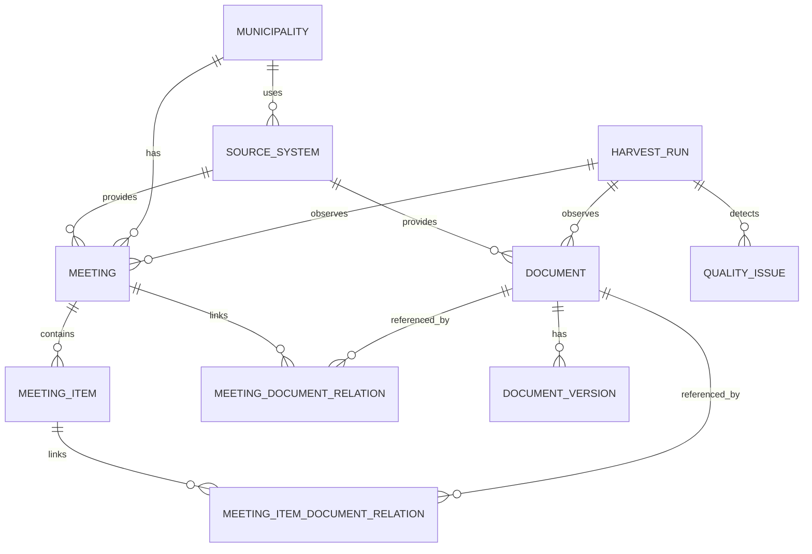

# Data model

Open RIS Monitor uses a canonical data model between vendor-specific RIS APIs and public JSONL exports. The model is document-first because users often search for documents first, then need meeting and agenda context.

## Current core entities

| Entity | Status | Purpose |
|---|---|---|
| Municipality | Implemented through configuration | Identifies the local deployment. |
| SourceSystem | Implemented through configuration | Describes the RIS vendor and endpoint. |
| Document | Implemented | Canonical public document metadata. |
| DocumentVersion | Implemented when checksum enrichment is enabled | Tracks observed document versions without storing PDFs. |
| HarvestRun | Implemented | Records run status, timestamps and counts. |
| Meeting | Implemented for relation exports | Canonical meeting context. |
| MeetingItem | Implemented for relation exports | Agenda or meeting item context. |
| MeetingDocument | Implemented for relation exports | Document-to-meeting link. |
| MeetingItemDocument | Implemented for relation exports | Document-to-agenda link. |
| QualityIssue | Implemented in quality reports | Dataset quality or consistency signal. |

Later concepts such as persons, organizations, decisions, topics, OCR text and notifications are outside the MVP scope.

## Entity relationship overview

This Mermaid diagram is intentionally included because it gives developers and data consumers a quick visual map of the model. It is conceptual, not a database schema. Open RIS Monitor still has no runtime database.



## Identifier policy

Canonical identifiers should be stable and scoped. Do not rely only on vendor IDs as public IDs.

Preferred pattern:

```text
{municipality_slug}-{resource_type}-{source_id}
```

Examples:

```text
huizen-document-25892
huizen-meeting-12345
huizen-meeting-item-67890
```

Always preserve the source identifier separately:

```text
source_id
```

If the source exposes multiple useful identifiers, preserve them explicitly, for example:

```text
source_object_id
```

## Municipality

Municipality data comes from configuration.

```json
{
  "id": "gm0406",
  "slug": "huizen",
  "name": "Huizen",
  "country": "NL",
  "official_identifier": "gm0406",
  "website_url": "https://www.huizen.nl",
  "ris_url": "https://ris.gemeenteraadhuizen.nl",
  "timezone": "Europe/Amsterdam"
}
```

## SourceSystem

The source system describes the RIS vendor and endpoint.

```json
{
  "id": "huizen-gemeenteoplossingen",
  "municipality_id": "gm0406",
  "vendor": "GemeenteOplossingen",
  "base_url": "https://ris.gemeenteraadhuizen.nl/api/v2/",
  "api_version": "v2",
  "connector": "gemeenteoplossingen",
  "active": true
}
```

## Document

A document is a vendor-neutral representation of a public RIS document.

Typical fields:

```json
{
  "schema_version": "1.0.0",
  "id": "huizen-document-25892",
  "source_id": "25892",
  "source_object_id": "43243",
  "municipality_id": "gm0406",
  "municipality_slug": "huizen",
  "source_system_id": "huizen-gemeenteoplossingen",
  "title": "Example document title",
  "description": "Example document description",
  "document_type": "Raadsvoorstel",
  "filename": "example.pdf",
  "mime_type": "application/pdf",
  "file_size_bytes": 62118,
  "publication_datetime": "2026-05-19T00:00:00+02:00",
  "publication_timezone": "Europe/Amsterdam",
  "source_url": "https://ris.gemeenteraadhuizen.nl/api/v2/documents/25892/download",
  "download_url": "https://ris.gemeenteraadhuizen.nl/api/v2/documents/25892/download",
  "is_confidential": false,
  "is_tabsign_document": false
}
```

## GemeenteOplossingen document mapping

| Source field | Canonical field | Notes |
|---|---|---|
| `id` | `source_id` | Source document ID. |
| `objectId` | `source_object_id` | Additional source object ID when present. |
| `description` | `title`, `description` | Often the best readable label. |
| `documentTypeLabel` | `document_type` | Cleaned and given fallback labels downstream. |
| `fileName` | `filename` | Original source filename. |
| `fileSize` | `file_size_bytes` | Source-reported size in bytes. |
| `publicationDate` | `publication_datetime`, `publication_timezone` | Normalized date and timezone where possible. |
| `confidential` | `is_confidential` | Converted to boolean. |
| `isTabsignDocument` | `is_tabsign_document` | Converted to boolean. |

## DocumentVersion

A document version records an observed file or metadata version. It does not mean the PDF is stored in Git.

```json
{
  "schema_version": "1.0.0",
  "id": "huizen-document-25892-version-20260622T120000Z",
  "document_id": "huizen-document-25892",
  "retrieved_at": "2026-06-22T12:00:00Z",
  "sha256": "...",
  "file_size_bytes": 62118,
  "content_changed": false,
  "metadata_changed": true,
  "previous_version_id": null
}
```

## HarvestRun

A harvest run records operational metadata about a pipeline execution.

```json
{
  "schema_version": "1.0.0",
  "id": "harvest-huizen-20260622T120000Z",
  "municipality_id": "gm0406",
  "source_system_id": "huizen-gemeenteoplossingen",
  "started_at": "2026-06-22T12:00:00Z",
  "finished_at": "2026-06-22T12:01:00Z",
  "status": "success",
  "profile": "public",
  "documents_seen": 100,
  "meetings_seen": 20,
  "meeting_items_seen": 100,
  "quality_issues_detected": 0
}
```

## Meeting

A meeting represents council or committee meeting context.

```json
{
  "schema_version": "1.0.0",
  "id": "huizen-meeting-12345",
  "source_id": "12345",
  "municipality_id": "gm0406",
  "source_system_id": "huizen-gemeenteoplossingen",
  "title": "Raadsvergadering",
  "body_type": "raad",
  "start_datetime": "2026-06-22T20:00:00+02:00",
  "end_datetime": null,
  "location": "Raadzaal",
  "source_url": "https://ris.gemeenteraadhuizen.nl/..."
}
```

## MeetingItem

A meeting item represents an agenda item or item-like source object.

```json
{
  "schema_version": "1.0.0",
  "id": "huizen-meeting-item-67890",
  "source_id": "67890",
  "meeting_id": "huizen-meeting-12345",
  "municipality_id": "gm0406",
  "number": "7",
  "title": "Vaststellen voorstel",
  "description": null,
  "position": 7,
  "source_url": "https://ris.gemeenteraadhuizen.nl/..."
}
```

## Relation direction

Relation exports should be explicit about direction.

```text
document -> meeting
document -> meeting_item
meeting -> meeting_item
```

The current public exports include specific relation files such as:

```text
meeting_documents.jsonl
meeting_item_documents.jsonl
```

Downstream consumers should treat these as public relation tables. Missing relations are possible when the source does not expose them or when a meeting is not yet complete.

## Public export contract

The public data model is the contract for the static viewer and downstream users. Structural changes should be versioned and documented in [export-contract.md](export-contract.md).

Related files:

- [export-contract.md](export-contract.md)
- [harvesting.md](harvesting.md)
- [quality.md](quality.md)

## Organisation entities, MVP 1.1

The organisation model adds lightweight civic context around the council organisation. It is separate from the document, meeting and agenda-item model.

Entities:

- group, a public group from `/groups`, commonly a fraction, committee or body;
- person, a public organisation actor from `/persons`;
- role, a public role from `/roles`;
- position, a public relation between person and role from `/positions`;
- group membership, an optional relation from `/groups/{groupId}/persons`.

The UI treats the following role categories as important for public interpretation: raadslid, fractievoorzitter, burgemeester, griffie and commissielid. These categories are derived conservatively from role names and are only used for grouping and filtering in the static viewer.
